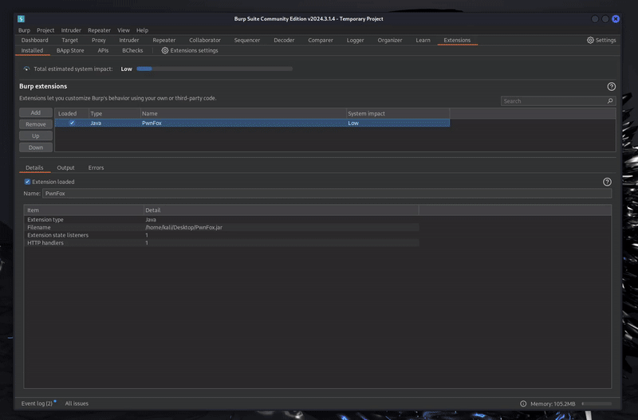
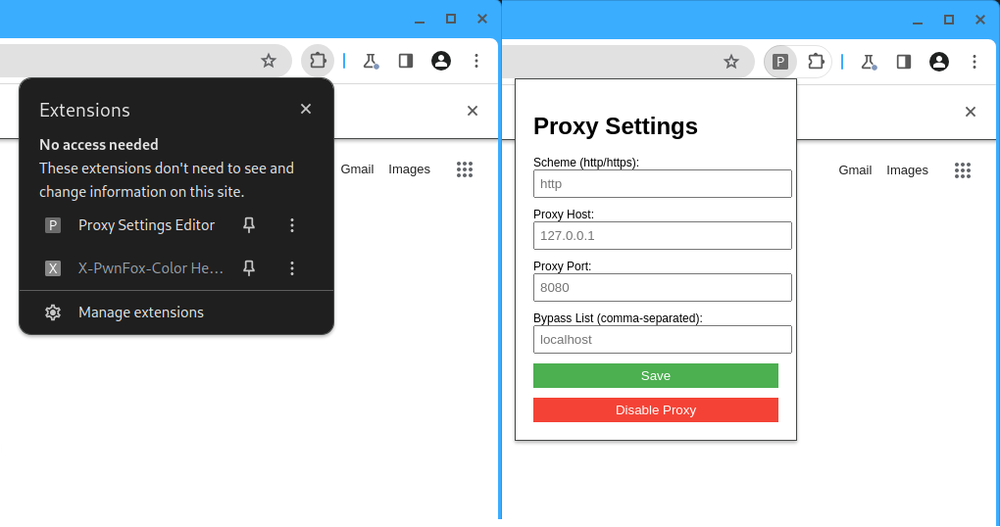

# PwnFox For Chromium
PwnFox For Chromium is a combination of a BurpSuite and browser addons that ports the functionality of the popular [PwnFox](https://github.com/yeswehack/PwnFox) BurpSuite extension directly to your Chromium.
PwnFox For Chromium allows you to:
- Set up Chromium to fully work with BurpSuite's proxy in a couple of clicks
- Launch Chromium directly from BurpSuite 
- Manage 8 separate Chromium user profiles for the ease of multi-account testing
- Clearly distinguish between user profiles through unique Chromium themes and color-coded HTTP traffic in the Proxy tab
- Extension settings persist between different sessions and only have to be configured once
- Works on Unix, MacOS and Windows



## Setup
1. Download the up-to-date `PwnFox-For-Chromium.jar` from the [Releases](https://github.com/adeadfed/PwnFox-For-Chromium/releases) tab
2. Import the PwnFox For Chromium JAR into the BurpSuite    
3. Launch the configured Chromium right from the extension tab in your BurpSuite and enjoy!

## Optional configuration
v1.2.0 release of PwnFox For Chromium automatically prepopulates the default settings when the extension is loaded, so you don't have to manually configure anything anymore. However, if you wish to tweak the settings or something has failed, these settings must be set at the bottom of the extension tab:
1. Path to the Chromium executable
> Browser executable that will be used by the extension. BurpSuite is shipped with an embedded Chromium in the `burpbrowser` folder; you can look up the location of your Burp Browser below ([## Burp Browser location](#burp-browser-location))

2. Path to the PwnFox For Chromium profile data directory
> Directory where browser data from the extension will be stored. Default value - `.PwnChromiumData`; You can set this setting to a different value to keep your work on the current project separated from the other ones.

## Burp Browser location
You can use Burp's built-in browser to deploy PwnFox for Chromium. Here are the common locations of Burp's Chrome executable:
### Windows
```
~\AppData\Local\Programs\BurpSuiteCommunity\burpbrowser\{VERSION}\chrome.exe
~\AppData\Local\Programs\BurpSuitePro\burpbrowser\{VERSION}\chrome.exe
```
### Linux
```
# kali installation
~/.BurpSuite/burpbrowser/{VERSION}/chrome
# official PortSwigger installers
~/BurpSuitePro/burpbrowser/{VERSION}/chrome
~/BurpSuiteCommunity/burpbrowser/{VERSION}/chrome
```
### MacOS
```
/Applications/Burp Suite Community Edition.app/Contents/Resources/app/burpbrowser/{VERSION}/Chromium.app/Contents/MacOS/Chromium
/Applications/Burp Suite Community Professional.app/Contents/Resources/app/burpbrowser/{VERSION}/Chromium.app/Contents/MacOS/Chromium
```

## Compiling the extension on your own with Maven
```
git clone https://github.com/adeadfed/PwnFox-For-Chromium
cd PwnFox-For-Chromium/burp
mvn clean compile assembly:single
ls -l target/PwnFox-For-Chromium*.jar
```

## Proxy configuration
You can edit Chromium proxy configuration and enable/disable it using the built-in Proxy Settings Editor Chromium extension


## Why this instead of [autochrome](https://github.com/nccgroup/autochrome)?
- PwnFox For Chromium is a one-click, ready-to-use solution after installation! Every dependency is embedded into the JAR file
- You don't need to download a separate Chromium browser for this extension. You can reuse the already existing Chrome/Chromium installation on your PC, or, even better, use the Chromium bundled with BurpSuite!
- The traffic will be color-coded in the Proxy tab exactly like in the [PwnFox](https://github.com/yeswehack/PwnFox) BurpSuite plugin
- All extension settings can be managed in BurpSuite directly
- Additional options for proxy configuration in the bundled Chromium extensions
- You can keep unique Chromium data for each engagement by separating the Chromium profile data directories
